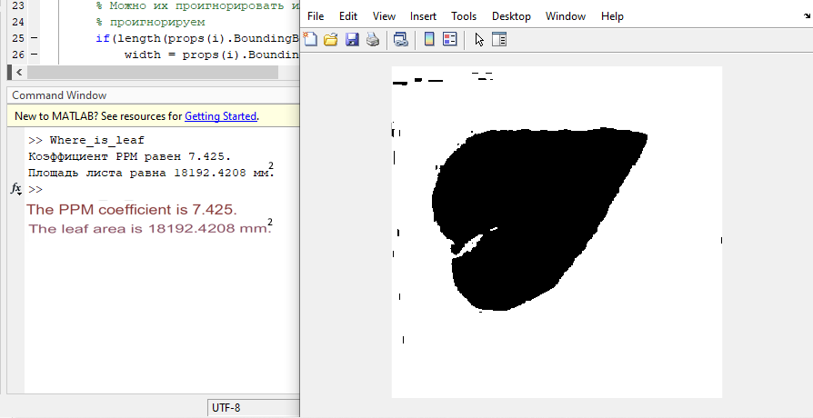

# The-area-of-the-object-through-the-photo
Determining the area of a physical object from a photo

This algorithm determines the area of the green object based on the photo (optional).
The principle is based on machine vision and the binding of an object to a pre-known coordinate system. 
Description of the experiment: A frame with previously known sides is drawn on a paper sheet. There is a green object inside the frame. Proportionally from the coordinate system of the camera, go to the coordinate system of the sheet and determine the area of the object.
File test.jpg to check the correct recognition of the area on the primitive.
The leaf file.jpg to check the correct recognition of an area on a physical object.
The algorithm is written in matlab
Using bwconncomp, regionprops

Данный алгоритм по фото определяет площадь объекта зеленого цвета (опционально).
Принцип основан на машинном зрении и привязывание объекта к заранее известной системе координат. 
Описание опыта: На бумажном листе рисуется рамка с заранее известными сторонами. Внутри рамки находится объект зеленого цвета. Пропорционально из системы координат камеры, переходим в систему координат листа и определяем площадь объекта.

Файл test.jpg для проверки правильного распознавания площади на примитиве.
Файл leaf.jpg для проверки правильного распознавания площади на физическом объекте.
Алгоритм написан на языке matlab
Используем bwconncomp, regionprops
